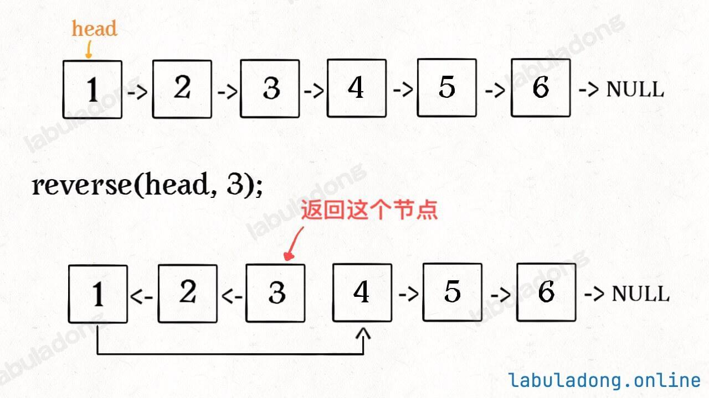

# 6.16
做了一下反转链表，还是有些手生啊

### 反转链表的前n个结点

要求大致如下



```javascript
//迭代解法
var reverseN = function(head,n){
	if(head === null || head.next === null){
		return head;
	}
	let pre = null,cur = head,nxt = head.next;
	while(n>0){
		cur.next = pre;
		pre = cur;
		cur = nxt;
		if(nxt!=null){
			nxt = nxt.next;
		}
		n--;
	}
	head.next = cur;//最终结束时候pre在反转的链表最后一个，nxt在正常结点的下一个
	//只有cur正好在n+1个
	return pre;
}
```

```javascript
//递归解法
//后驱结点
let successor = null;
var reverseN = function(head,n){
	if(n === 1){
		successor = head.next;
		//记录链表下一个结点
		return head;
	}
	let last = reverseN(head.next,n)
	
	head.next.next = head;
	head.next = successor;
	return last;
}
```